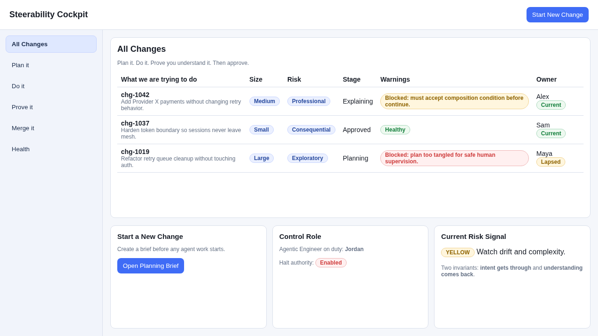
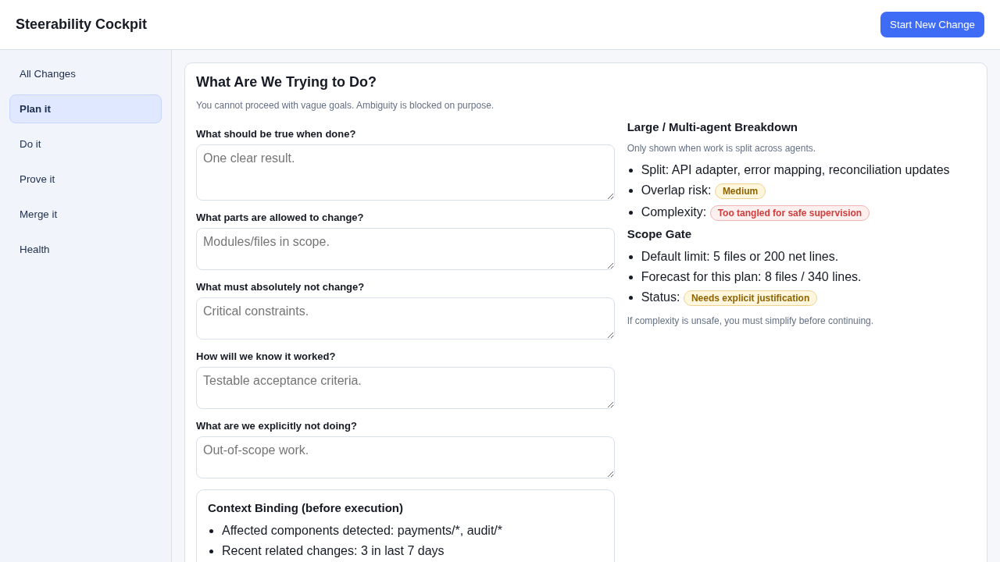
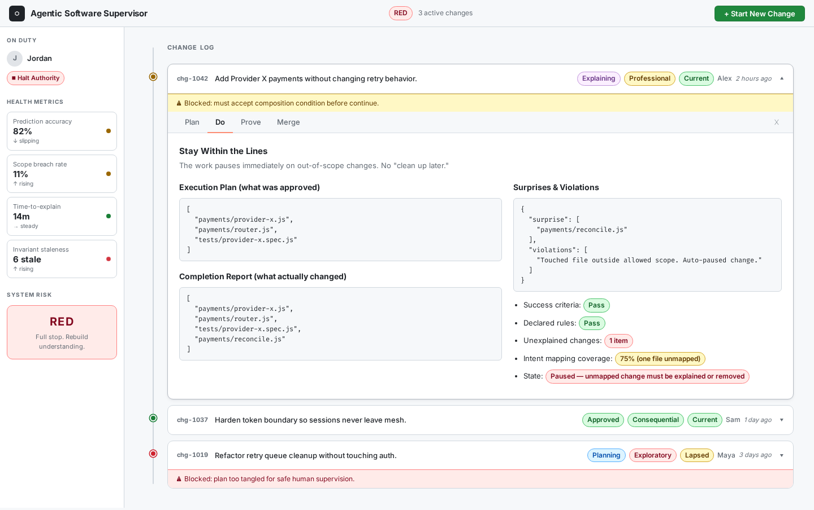
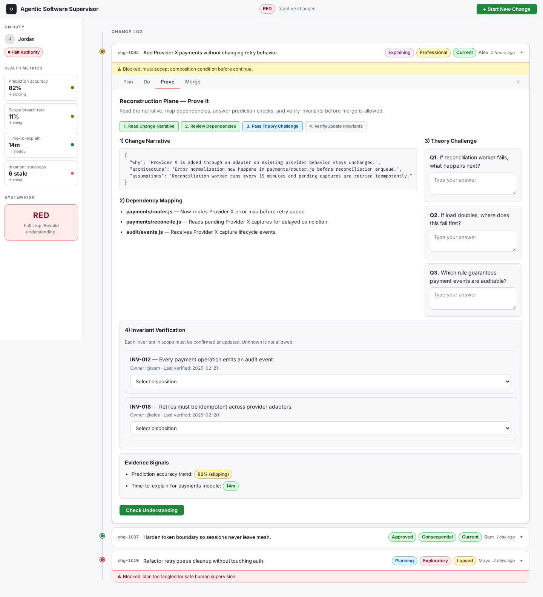
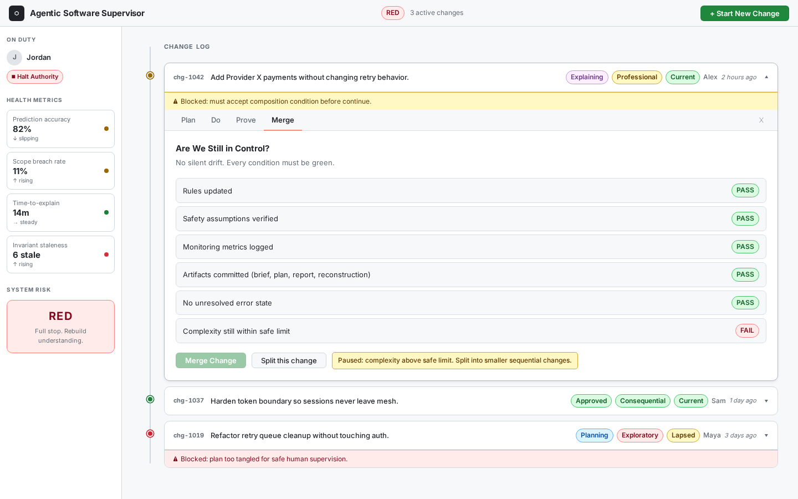
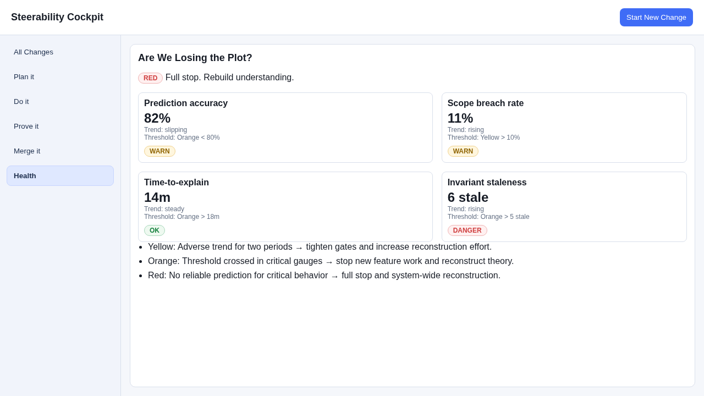

# Agentic Software Supervisor — A Guided Flight

This walkthrough is a story about one change moving through the supervisor UI in `src/ui`.

The problem it solves is not “did the code compile?” It’s the slower failure mode described in *The Directive Plane* paper: **systems that keep working while becoming progressively unknowable**. Agents can increase implementation velocity overnight; human comprehension does not scale the same way. That gap creates a predictable instability: you can ship correct diffs while quietly losing the ability to steer.

The supervisor is designed to prevent that. It protects two invariants:
- **Outbound intent fidelity**: what you meant reaches the machine without scope/meaning loss.
- **Inbound theory preservation**: what the machine did comes back as human understanding, not just output.

Today, **Jordan** is the Agentic Engineer on duty. She still works on features like everyone else, but she also carries the control-loop responsibilities:

- **Reads the gauges.** She monitors the four health metrics (Prediction Accuracy, Scope Breach Rate, Time-to-Explain, Invariant Staleness) and is accountable for knowing whether the system is still steerable.
- **Has halt authority.** She can slow or stop agent-driven work when the control loops are degrading. This authority is real, not advisory — it's backed by organizational structure.
- **Maintains signal integrity.** She ensures that Theory Challenges test for genuine understanding and that controls don't degrade into ritual.

The engineer who owns a change — like **Alex** on chg-1042 — is the one who must pass reconstruction. Alex answers the Theory Challenge questions and proves he understands what the agents built before the change can merge. Jordan's job isn't to hold the theory of every change; it's to make sure the system that *requires* Alex to hold it is actually working.

The UI is structured as three phases (Plan / Do / Prove), plus Merge and Health.

---

## 1) All Changes (Home): “Where are we, really?”

You land on **All Changes** the way a pilot looks at a flight deck before touching the controls.

Each row is a single change in flight. The row is intentionally plain:
- the objective (one sentence)
- size and risk
- the stage (Planning / Doing / Explaining / Approved)
- warnings that say **blocked because…**
- the owner, with a **Current / Lapsed** badge

That currency badge is not a punishment system. It’s a safety signal.
The paper’s central asymmetry is that the human doesn’t automatically “hold the theory” of agent work. If we stop checking theory, we don’t just lose knowledge—we lose the ability to verify future work, and trust collapses into either blind acceptance or defensive rejection.

**Why these elements matter:**
- **Stage + warnings** make drift visible early (before it compounds).
- **Risk + size** acknowledge that not every change needs the same control intensity.
- **Currency** treats human reasoning capability as an operational dependency (like proficiency in aviation automation).

---

## 2) Plan it (Directive Plane): “Clear intent before power.”

You click **Start New Change** and the supervisor moves you into **Plan it**.

This is where the system forces intent to become *falsifiable*. You’re asked five simple questions, but they’re doing heavy work:
- What should be true when we’re done?
- What parts may change?
- What must not change?
- How will we know it worked?
- What are we explicitly not doing?

If you write “make it better,” the UI blocks you.
That’s not pedantry—it’s a defense against the paper’s R3 loop: **intent drift** (humans describing what they believe the system is, not what it actually is).

Two supervisor features reinforce that defense:

1) **Context binding**
You’re shown the system state relevant to the change (affected components, recent related changes, invariants in scope). This is how the supervisor prevents you from writing a plan against a stale mental model.

2) **Scope gate + complexity warning**
If the change forecast is too large—or if multi-agent decomposition is too tangled for a human to supervise—the supervisor stops you and pushes you to simplify. This is envelope protection: a bounded change keeps reconstruction tractable.

**Why these elements matter:**
- A good brief prevents R1 (velocity trap) from accelerating by keeping intent precise.
- Scope gating prevents “comprehension overflow” where humans stop trying to understand.
- Complexity warnings acknowledge the hard ceiling on human bandwidth.

---

## 3) Do it (Execution Plane): “Stay within the lines.”

Now the system has permission to execute—but not permission to improvise.

On **Do it**, the supervisor behaves like mode annunciation in aviation: it continuously shows what the automation *thinks it’s doing* and what it’s *actually doing*.

The UI compares:
- **Execution Plan** (what was approved)
- **Completion Report** (what actually changed)

And it calls out three things loudly:
- surprises
- violations
- unmapped work (changes that don’t trace back to intent)

If the agent touches out-of-scope files or produces unexplained modifications, the change pauses immediately. The point is to close the loop **while the change is still small enough to correct**.

**Why these elements matter:**
- This is how intent violations become *visible*, automatically, instead of relying on heroic review.
- It prevents silent expansion of complexity that you’ll pay for later in theory debt.

---

## 4) Prove it (Reconstruction Plane): “Do you hold the theory?”

This is the heart of the supervisor.

The paper’s warning is that you can accumulate months of technically-correct output while theory drains underneath. The failure mode isn’t a crash—it’s the slow loss of steerability.

So the supervisor makes reconstruction explicit and uncomfortable by design:
1) **Change Narrative**: architectural why, not a diff summary
2) **Dependency mapping**: what else is affected (to surface invisible coupling)
3) **Theory challenges**: prediction questions (challenge-and-response, not acknowledgement)
4) **Invariant verification**: confirm or update assumptions, with ownership and freshness

If you can’t answer prediction questions, the merge is blocked.
You go back, read, and rebuild theory.

**Why these elements matter:**
- Prediction is falsifiable; “I understand” is not.
- Dependency mapping is a direct countermeasure to coupling-driven theory loss.
- Invariants prevent “rot”: stale assumptions are worse than none.

---

## 5) Merge it: “Are we still steerable after this?”

Merge is treated like a controlled handoff, not a reward.

Before the supervisor lets the change land, it checks that control artifacts and safety assumptions are actually in place:
- rules and assumptions are updated
- monitoring metrics are recorded
- artifacts are committed (so intent and theory don’t evaporate)
- no unresolved error state remains
- complexity is still within safe limits

If complexity is too high, the supervisor doesn’t negotiate—it pauses and pushes you to split the work into sequential, reviewable changes.

**Why these elements matter:**
- The system can keep “forwarding based on stale state” (like networks) unless you enforce the control plane.
- This gate prevents delayed damage from accumulating unnoticed.

---

## 6) Health: “Are we losing the plot?”

Finally, the supervisor zooms out.

The paper is clear: without instrumentation, you don’t know you’ve become unsteerable until production teaches you.

So **Health** shows the gauges that correspond to steerability:
- **Prediction Accuracy**: when the supervisor asks “what happens next if X fails?”, how often do humans answer correctly? If this drops, the team is *shipping changes they can’t reliably reason about*.
- **Scope Breach Rate**: how often does work escape the declared boundaries (extra files touched, surprise side-effects). A rising rate means the system is learning that “the rules are optional.”
- **Time-to-Explain**: how long it takes a human operator/engineer to give a clear, causal explanation of the change (not a diff tour). If this climbs, the system is becoming harder to navigate—even if it still “works.”
- **Invariant Staleness**: how many “must-always-be-true” assumptions haven’t been re-checked recently. Stale invariants are dangerous because people keep relying on them after they’ve quietly become false.

It translates trends into action thresholds:
- **Yellow**: tighten controls and increase reconstruction effort
- **Orange**: halt new agent feature work; rebuild theory
- **Red**: full stop; system-wide reconstruction (the SCRAM equivalent)

**Why these elements matter:**
- Metrics are not vanity—they’re alarms.
- Thresholds turn “we should probably…” into “we stop now,” before it’s too late.

---

## The point of the supervisor

This UI is not a feature dashboard. It is a control system.

It lets you use agent speed **without** entering a ballistic trajectory: fast, impressive, and impossible to redirect once you realize you’re wrong.
